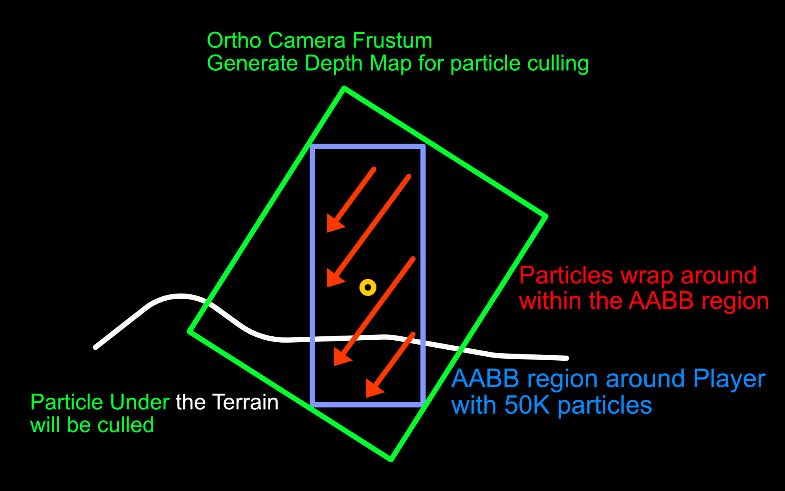
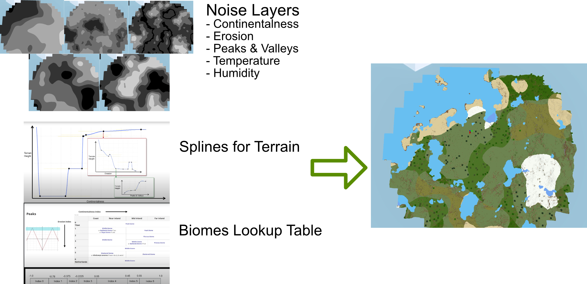
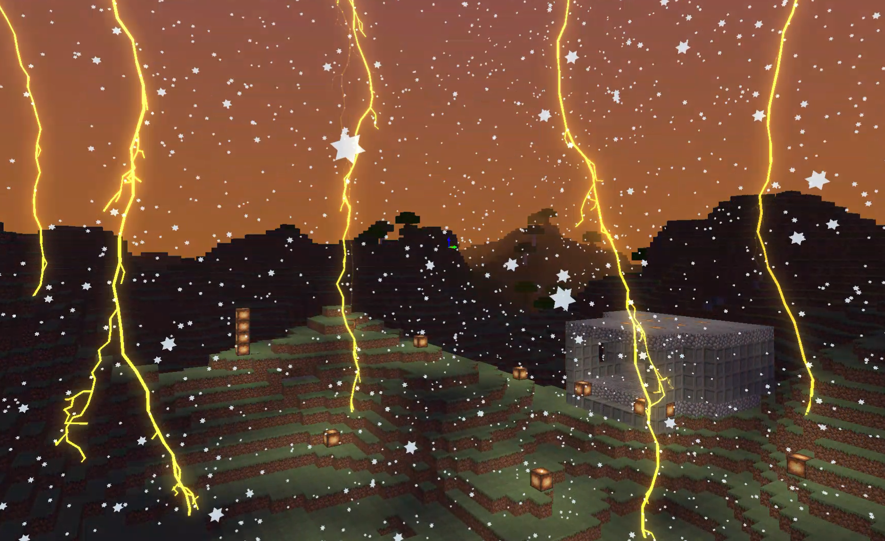
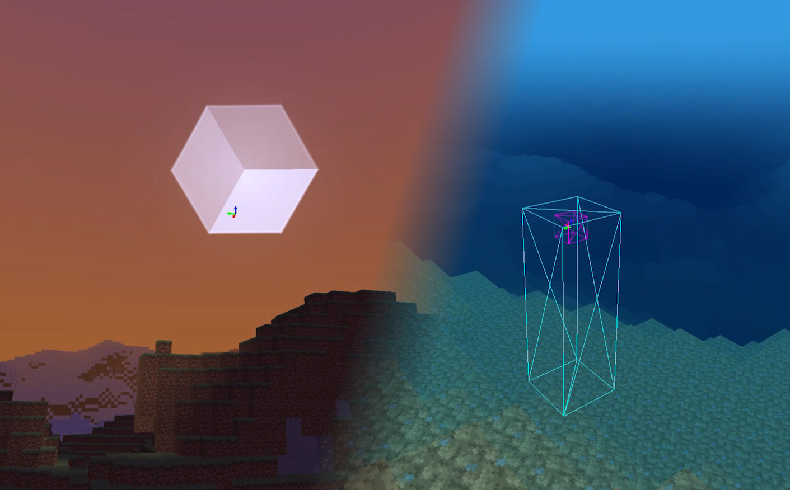
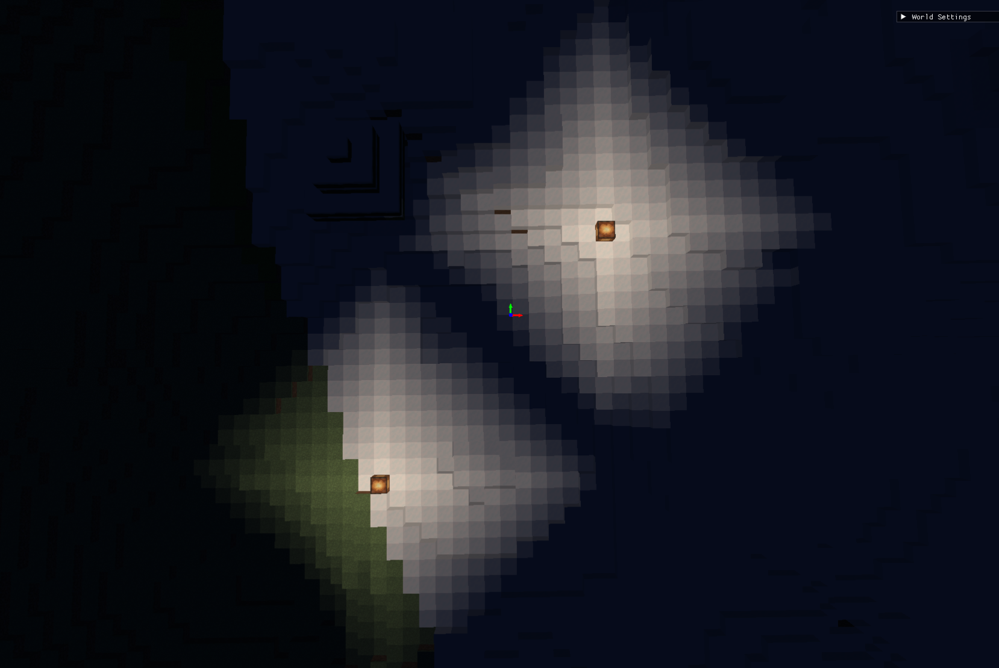

# SimpleMiner
A Minecraft clone built with my personal C++ engine and DirectX 12 

## Features
- Multithread World Generation using multi-octave noise with Job System
- Outdoor and Indoor lighting propagation
- 50,000 Rain Particles with compute shader updates and depth-based culling
- Procedural Lightning with fractal 3D mesh generation and bloom post-processing
- Beer-Lambert underwater shader and Stylized Sky Shader
- Swept AABB Collision using Raycast

## Gallery
> Rain Particle System
> 

> World Generation
> 

> Fractal 3D Lightning Mesh with Bloom Post-processing
> 

> Sky & Underwater Shader
> 

> Light Propagation
> 


## How to run
Go to `PROJECT_NAME/Run/` and Run `PROJECT_NAME_Release_x64.exe`

## How to build
1. Clone Project
```bash
git clone --recurse-submodules https://github.com/cloud-sail/SimpleMiner.git
```
2. Open Solution `PROJECT_NAME.sln` file
- In Project Property Pages
  - Debugging->Command: `$(TargetFileName)`
  - Debugging->Working Directory: `$(SolutionDir)Run/`


## Controls
```
- WASD: Move
- Mouse: Look around
- Space: Jump / Fly up
- Shift: Fly down
- Left Click: Dig block
- Right Click: Place block
- F1: Toggle camera mode
- F2: Toggle physics mode
- T: Spawn lightning strike
```